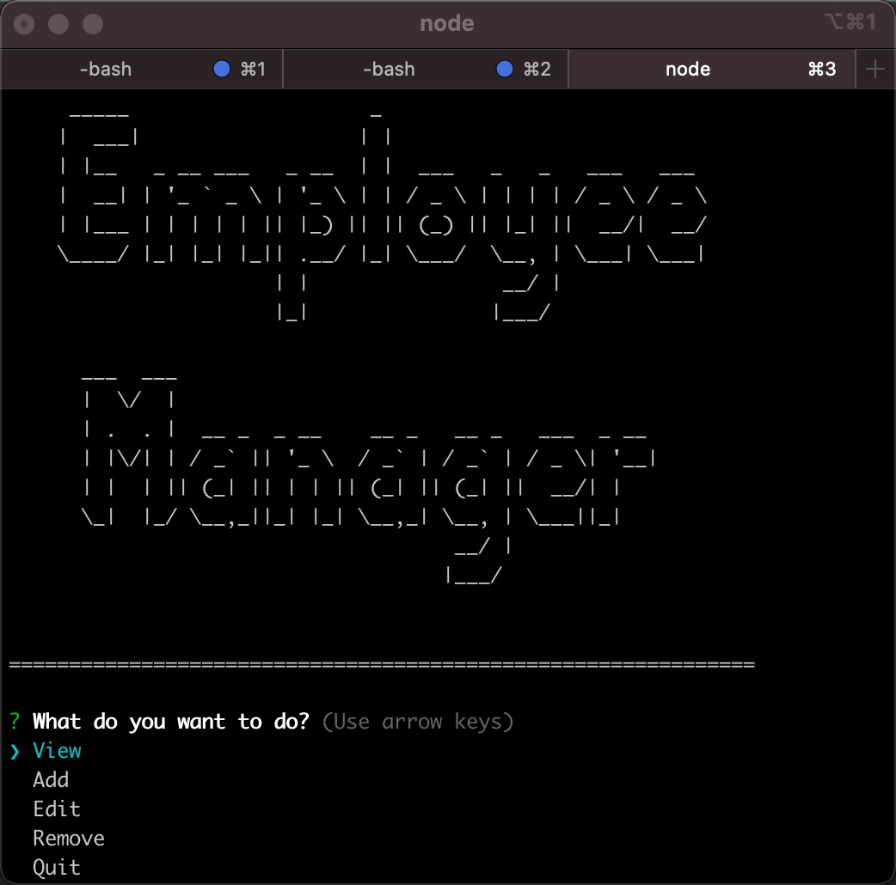
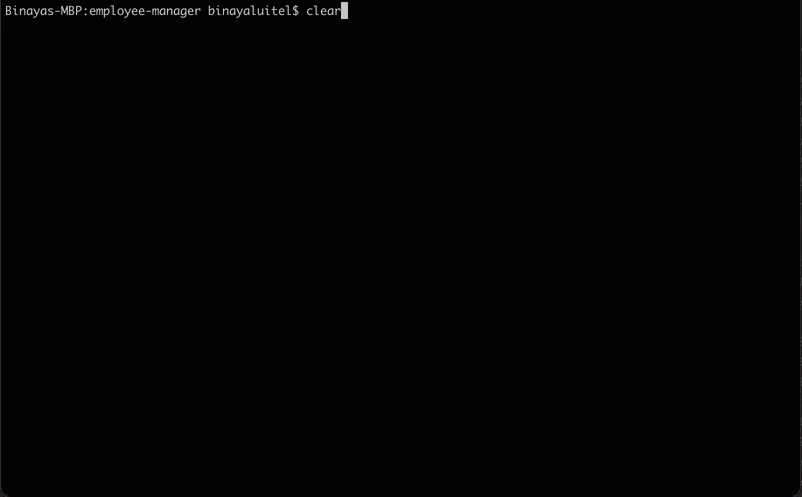

## Description 
   
This is a a command-line application that at a minimum allows the user to:

  * Add departments, roles, employees

  * View departments, roles, employees

  * Update employee roles
 


 

  ## Table of Contents
  * [Installation](#installation)
  * [Usage](#usage)
  * [Contributing](#contributing)
  * [Tests](#tests)
  * [License](#license)
  
  ## Installation
    
Clone the repository to your local development environment.

```
git clone https://github.com/binayaluitel2/employee-manager.git
```

Navigate to the employee-manager folder using the command prompt.


Run `npm install` to install all dependencies. Then run `node index.js` to start the application. Once the application is start please follow the prompts to create, edit or delete the department, roles or employees.

  ## Usage 
    
  
  
  ## Contributing
  
  Binaya Luitel
  
  ## Tests  
  
 None
  
  ## License
  
  MIT License
  
